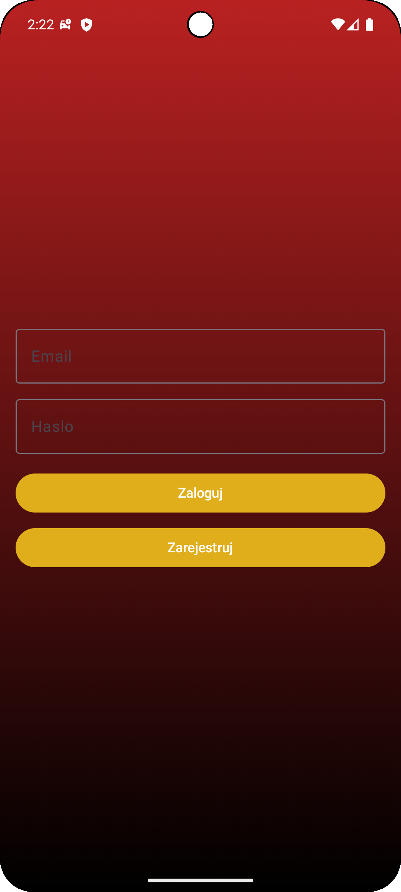
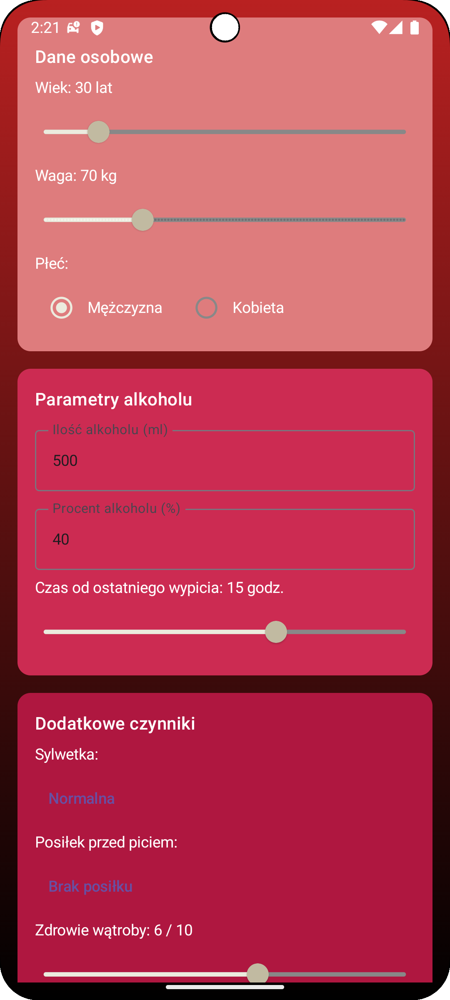
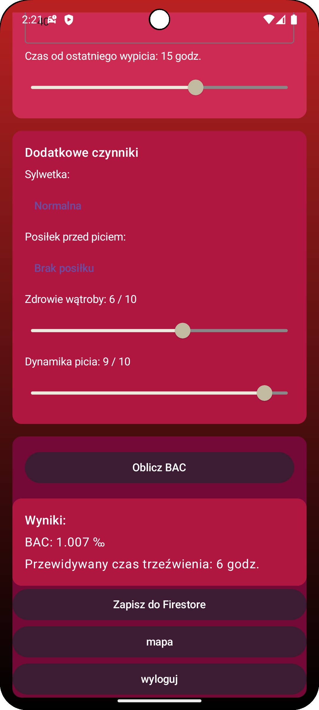
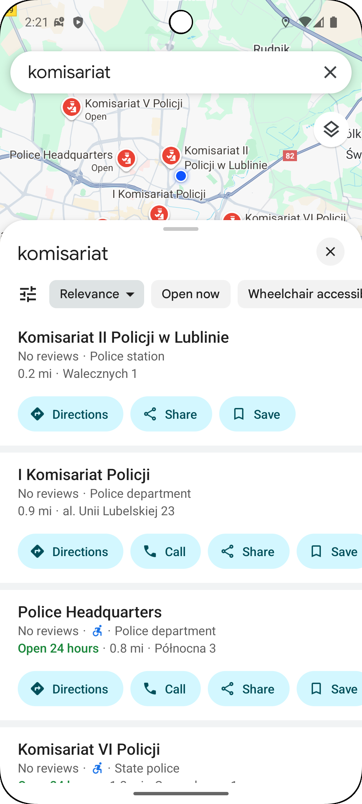

# Mobilny alkomat - aplikacja do sprawdzenia stanu alkoholu we krwi

Aplikacja stworzona jest w Kotlinie wraz z wykorzystaniem chmury Firestore, pozwala sprawdzić ile osoba badająca się miała we alkoholu we krwi oraz jak dużo czasu będzie potrzebować aby całkowicie wytrzeźwieć. Projekt stworzony w celach naukowych jak i w celach czysto funkcjonalnych.

## Funkcjonalności
1. Możliwość sprawdzenia ilości alkoholu we krwi w szczytowym momencie.
2. Możliwość sprawdzenia czasu jakiego potrzebujemy aby całkowicie wytrzeźwieć.
3. Logowanie i rejestracja pozwala korzystać wielu osobom na raz.
4. Dane wpisywane w aplikacji są przechowywane w chmurze co pozwala na weryfikację osoby i momentu sprawdzenia trzeźwości.
5. Aplikacja w celu upewnienia się czy jest się trzeźwym, ma opcje pokazania w mapach Google komisariaty policji.
6. Aplikacja wysyła powiadomienie w celu przypomnienia czy faktycznie jesteśmy trzeźwi.

## Wygląd działania aplikacji
<table>
  <tr>
    <td align="center">
       
      Ekran logowania/rejestracji
    </td>
    <td align="center">
       
      ekran główny
    </td>
    <td align="center">
       
      ekran główny z trzema opcjami
    </td>
    <td align="center">
       
      wygląd map google
    </td>
</table>

## Uruchomienie aplikacji
1. Pobierz Android Studio wraz z (Android SDK, Emulator, Android Virtual Device) ze strony: https://developer.android.com/studio
2. Uruchom Android Studio.
3. Pobierz plik ZIP, wypakuj go do nowego folderu. [Mobilny alkomat- Dropbox](https://www.dropbox.com/scl/fi/zz71vzfqzsbw134750ffr/appz.zip?rlkey=owwa4tmo2cdz6j7l22aso22sr&st=cnxo0p9k&dl=1)
5. Otwórz projekt w aplikacji, W Android Studio kliknij Open -> Wskaż folder w którym rozpakowałeś ZIP ->Kliknij OK/OPEN.
6. Poczekaj na pobranie zależności (Gradle), jeśli u góry pojawi się "Sync Now" kliknij go, jeśli pojawią się błędy o brakujących składnikach SDK kliknij "Install missing component", (ten krok może chwilkę potrwać).
7. W razie błędów sprawdź konfigurację SDK, File -> Project Structure -> Default Config, target SDK = 35 , min SDK version = 24, jeśli tego brak Android Studio zaproponuje pobranie.
8. W przypadku braku błędów otwórz emulator, Tools -> Device Manager -> Create device, należy w wybrać dowolny model telefonu np. Pixel 8 oraz wybieramy jego system API 35, pobieramy obraz systemu oraz włączamy emulator.
9. Klikamy run czyli shift + F10 lub zielony trójkąt na górnym pasku.
 ## Plan rozwoju
1. Dodanie więcej pól wraz z informacjami o osobie korzystającej w celu lepszej oceny nietrzeźwości
2. Bardziej dokładne przedstawienie informacji jak zmieniał się poziom alkoholu we krwi
